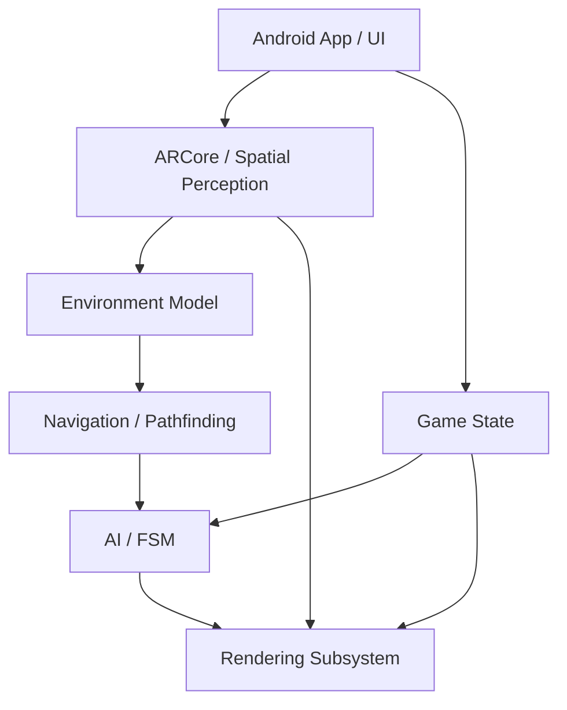

# Software Architecture Design

This document describes the structural and behavioral design for the AR Embedded Systems Game.

## 1. System Modules & Responsibilities

The application is decomposed into strictly separated modules to ensure testability and prevent "god objects".

1. **Android App (UI/Lifecycle):** Handles Android Activity lifecycle, permissions (Camera), surface creation, and system UI (debug overlays).
2. **AR / Spatial Perception:** Wraps the ARCore `Session`. Responsible for camera tracking, extracting depth maps, plane detection, point clouds, and managing anchors. Pushes spatial data to the Environment Model.
3. **Environment Model:** Maintains the 2.5D Occupancy Grid. Merges plane data and depth data over time. Filters out noise and manages the "confidence" of each cell.
4. **Procedural World:** Generates virtual dungeon layouts on top of the physical occupancy grid.
5. **Navigation:** Implements A* pathfinding over the occupancy grid. Responsible for inflating obstacles (so agents don't clip through real obstacles) and smoothing paths.
6. **AI:** Implements a Finite-State Machine (FSM) for autonomous agents (states: IDLE, WANDER, CHASE, SEARCH, COVER). Queries the Navigation module for movement.
7. **Rendering (OpenGL ES):** Renders camera feed as background, then draws 3D virtual geometry. Uses ARCore depth maps to implement depth-aware occlusion in fragment shaders.
8. **Game State:** The central coordinator. Holds active agents, objectives, and overall simulation state.
9. **Systems / Performance:** Monitors FPS, thread timing, memory, and thermal state.

## 2. Threading Model

AR applications are highly concurrent. Blocking the UI or Render threads will cause tracking loss or visual stutter.

1. **Android UI Thread (Main):**
   - Handles touch events, Android lifecycle, and debug UI updates.
   - *Constraint:* NO heavy computation, NO OpenGL calls, NO ARCore frame processing.
2. **GL Render Thread (GLSurfaceView Thread):**
   - Handles `Session.update()`, camera background rendering, and 3D drawing.
   - *Constraint:* Must hit 30/60 FPS consistently. Do not perform pathfinding or map generation here.
3. **Environment/Perception Worker Thread:**
   - Extracts depth arrays, downsamples point clouds, and updates the occupancy grid.
   - *Constraint:* Runs at a lower rate (e.g., 10-15 Hz) to avoid starving the CPU.
4. **AI & Navigation Worker Thread(s):**
   - Calculates A* paths, executes AI state machines, and updates virtual agent positions.
   - *Constraint:* Uses Kotlin Coroutines / thread pools for asynchronous path queries.

## 3. Core Data Structures

- **World Coordinates:** ARCore World Coordinate System (Right-handed, Y-up, meters).
- **OccupancyCell:** `data class OccupancyCell(val x: Int, val z: Int, var state: CellState, var confidence: Float)`
  - *CellState:* `UNKNOWN`, `FREE`, `OBSTACLE`.
- **OccupancyGrid:** 2D array representing a discretized X-Z plane (e.g., 5cm resolution).
- **AgentState:** Enum for the FSM (`SPAWNING`, `IDLE`, `PATROL`, `CHASING`, `HIDING`).
- **Path:** List of `Vector3` waypoints generated by A*.

## 4. ARCore Subsystem Design

- **Session:** Configured with `Config.DepthMode.AUTOMATIC` and `Config.PlaneFindingMode.HORIZONTAL_AND_VERTICAL`.
- **Camera Pose:** Used to position the user/player in the game state.
- **Depth API:**
  1. *CPU:* Extracted periodically to populate the Occupancy Grid with obstacles.
  2. *GPU:* Passed to fragment shaders to occlude virtual geometry behind real-world objects.
- **Anchors:** Used sparingly for dungeon origin and key anchors to conserve ARCore tracking resources.

## 5. Rendering Subsystem Design

- **API:** OpenGL ES 3.0+ (required for depth texture sampling).
- **Surface:** `GLSurfaceView` managing an EGL context.
- **Shaders:**
  - *Background Shader:* Renders camera feed texture via `samplerExternalOES`.
  - *Occlusion Shader:* Samples ARCore depth texture. If `virtual_depth > physical_depth`, fragment is occluded.
- **Decoupling:** Render thread reads from a thread-safe snapshot of Game State.
